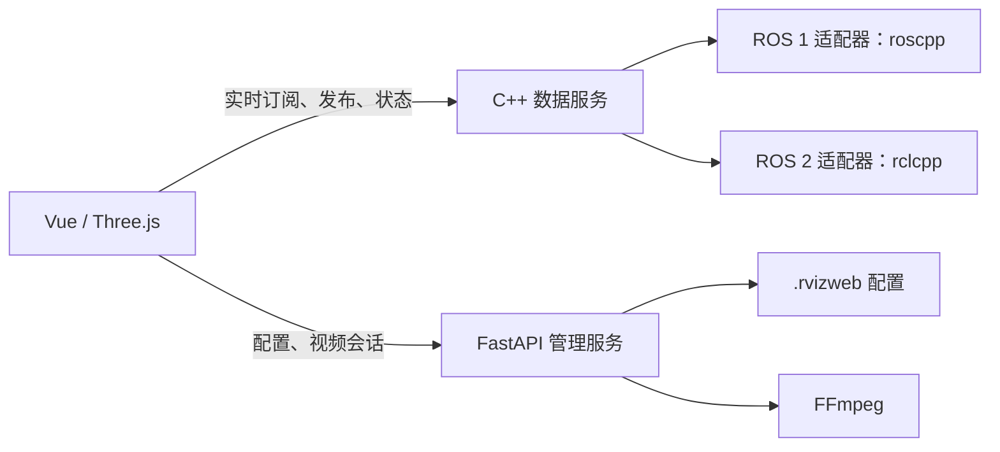

# 后端 v2：ROS 原生接入与通信演进

状态：阶段 0 / 1 已完成，阶段 2 显示、阶段 3 控制/恢复与阶段 4 本地部署已实现，第五阶段共享处理与诊断已实现并完成 ROS2 短时验收；Docker 搁置；本地启动和网页固定使用 v2，旧 Python ROS 实现已移除。支持 ROS 1 / ROS 2 分别构建；C++ 接入 ROS，FastAPI 管理配置与视频。构建、协议和验证说明见 [backend/README.md](../backend/README.md)。

## 当前实现核查

当前项目不依赖外部 `rosbridge_server`，也没有通过 `roslibpy` 转接 ROS。

| 边界 | 当前实现 | v2 迁移注意事项 |
| --- | --- | --- |
| ROS 1 | `backend/management/app/services/ros1/adapter.py`，直接使用 rospy | 保留 ROS Master 配置、动态类型和静态 TF 行为 |
| ROS 2 | `backend/management/app/services/ros2/adapter.py`，直接使用 rclpy | 保留话题发现、QoS、动态类型和 TF 行为 |
| 应用契约 | `ros_contract.py`、`ros_application.py` | 已隔离适配器与会话管理，可作为能力清单 |
| WebSocket | `ros_gateway.py`、`ws_handlers.py` | 自有服务，使用类似 rosbridge 的 op/topic/type 字段 |
| 点云传输 | `connection_manager.py`、前端 `pointCloudBinary.js` | 已有 RVPC 二进制封装，不是全量 JSON/Base64 点云 |
| 前端接口 | `useRosbridge.js`、`useConnectionStore.js` | 名字不能代表仍依赖 rosbridge；迁移应覆盖真实协议和恢复语义 |
| 管理与视频 | FastAPI 配置接口、FFmpeg 视频会话 | 与 ROS 接入分开确定是否重写 |

因此，v2 应以直接接入能力、明确的协议边界、可验证的性能及部署体验为目标。仅重命名前端文件不构成 v2。

## 参考项目

- [ROS_Flutter_Gui_App](https://github.com/chengyangkj/ROS_Flutter_Gui_App)：主 README 说明 v2 改用 C++ 后端，取消 rosbridge。
- [后端说明](https://github.com/chengyangkj/ROS_Flutter_Gui_App/blob/main/backend/management/README.md)：采用 Drogon HTTP/WebSocket，与 ROS 节点同进程运行。
- [协议定义](https://github.com/chengyangkj/ROS_Flutter_Gui_App/blob/main/protocol/robot_message.proto)：定义机器人状态、图像、心跳及控制等 Protobuf 消息。

该项目偏向二维导航应用。RVizWeb 需要保留动态 Displays、任意数值话题曲线、三维点云、Marker 和 TF；不能直接用固定的机器人状态消息替换所有话题。
其主 README 与后端 README 对 ROS 1 支持程度的描述不同，不能据文档推定功能完全对等；本项目的 ROS 1 / ROS 2 需要分别验收。

## 已确定的职责划分

### C++ ROS 数据服务 + FastAPI 管理服务

第一阶段已按此架构实现只读接入。C++ 负责高频数据接收、转换、编码和推送；FastAPI 保留配置与视频管理。浏览器通过同一个对外入口按路径访问两个服务，高频数据不经过 Python 再转发。

每个 C++ 进程只加载一种 ROS 环境，分别构建 ROS 1 / ROS 2 产物。若以后同机同时接两种 ROS，运行独立进程并暴露明确的连接标识；本阶段不实现 ROS 1 / ROS 2 互相转发。

代价：部署需要管理两个服务，并统一连接地址、运行状态与请求权限。全 C++ 路线可减少运行时语言种类，但需要迁移全部配置校验、备份、视频进程生命周期和 HTTP 接口。保留 Python 路线改动较小，是否存在性能限制应由基准测试确定。

## 对外入口与部署建议

保留浏览器单一访问地址，由同源反向代理按路径转发：

| 路径 | 负责服务 | 用途 |
| --- | --- | --- |
| `/api/v2/ros/*` | C++ | 健康、能力、话题、类型、节点与运行指标 |
| `/ws/v2/ros` | C++ | 订阅、退订、控制请求、确认与实时数据 |
| 现有配置、视频 HTTP 路径 | FastAPI | `.rvizweb` 管理、FFmpeg 会话与视频输出 |
| `/` 与前端静态资源 | 统一入口 | 复用 Vue / Three.js 前端 |

v2 路径为建议契约。旧 ROS v1 路由已移除；前端固定使用 v2，不能在故障时自动换服务并重发控制指令。

C++ 以 C++17 为基线，ROS 1 / ROS 2 使用各自适配器与独立构建目录。第一阶段选用 Boost.Beast 与 JsonCpp，ROS 回调通过有界队列交给网络事件循环。本机 ROS 2 Humble 可作为首个验证环境，ROS 1 沿用现有部署目标并补齐 C++ 构建和回放验证。

FastAPI 在 v2 模式下只启动配置、系统管理和视频相关能力，不再初始化 rospy/rclpy；这需要显式调整现有启动生命周期，不能仅新增一个 C++ 进程而让两边同时订阅。

## v2 协议要求

建议首版采用 JSON 控制消息与二进制大数据帧，复用现有 RVPC 点云封装并明确协商版本。Protobuf 作为后续评估项，不把更换编码方式本身作为性能提升。

1. 明确协议版本与能力协商：ROS 版本、支持的消息类型、编码方式、QoS 可选项、最大帧长。
2. 区分请求响应、状态事件与话题数据；所有可确认操作携带 request_id，返回稳定错误码。
3. 动态发现话题及其类型。通用消息支持字段描述与值读取，使数值曲线和自定义消息不会退化。
4. PointCloud2 保留原始 bytes 和字段描述；明确大小端、point_step、row_step、时间戳和 frame_id。紧凑 XYZ 作为显式选项，不能悄悄删除 intensity/rgb 等字段。
5. 为点云、图像和栅格等大消息提供二进制数据路径。先比较现有 RVPC 与候选编码的端到端成本，再决定复用还是替换。
6. 控制响应有独立的队列策略，不能被可丢弃的显示帧覆盖；显示数据可按话题保留最新帧，并公开丢帧计数。
7. 每客户端、每话题设置队列和字节上限；慢客户端不会阻塞 ROS 回调或其他客户端。
8. TF 动态数据和静态快照采用不同缓存策略；重连后恢复静态 TF 与订阅，不重放曾经发出的目标/控制指令。
9. 订阅确认只表示订阅已建立，不能当作已经收到数据。发布确认区分本地提交与机器人执行完成。
10. 保留来源校验、操作限制和消息大小限制；迁移不能绕过原有接入约束。

## 前端迁移边界

现有 UI、Three.js 渲染、点云 Worker 与配置文件继续使用。新增传输接口，负责连接、能力发现、订阅、退订、发布与错误事件；v1/v2 的协议差异放在传输适配器内，不散落到各个显示组件。

迁移后对业务组件使用 `useRosClient` 一类中性名称，只保留原生适配器。协议迁移必须验证 TF 缓存、断线订阅恢复、发布确认以及自定义数值字段。

## 分阶段交付

| 阶段 | 可运行结果 | 验收 |
| --- | --- | --- |
| 0：基线与契约 | 当前功能清单、测试数据、协议与部署契约 | 不把已有直连/二进制能力计作新增功能 |
| 1：最小贯通 | v2 服务启动、健康检查、话题列表、订阅/退订、Odometry 与 PointCloud2；前端独立 v2 连接入口 | ROS 1、ROS 2 分别实际接收并显示数据 |
| 2：显示能力补齐 | TF、LaserScan、Path、Marker/MarkerArray、OccupancyGrid、动态字段曲线 | 同一输入下与 v1 对照，并覆盖静态 TF 和 QoS |
| 3：控制与恢复 | 发布目标/初始位姿、连接重建、资源释放、多客户端隔离 | 模拟订阅者检查消息，断线不重放控制命令 |
| 4：本地部署 | 配置兼容、启动脚本、源码发布包、部署说明；Docker 按当前要求搁置 | ROS 1、ROS 2 本地启动验收，明确回退方法 |

建议第一次编码仅交付阶段 0 与阶段 1：

- 独立目录 `backend/`，包含公共接口、ROS 1 / ROS 2 适配器、网络与协议模块、测试和构建说明。
- 能连接、列出话题、订阅并显示 PointCloud2 / Odometry，正常退订与断开。
- ROS 2 在本机实际验证；ROS 1 必须在具备依赖的目标环境完成编译和实际订阅，不能用 mock 测试宣称完整支持。
- 核对点云字节、字段、时间戳与帧名，确认控制响应与大消息推送的队列隔离。

v1 历史实现可通过 Git 查看；本地启动已固定使用 v2，不提供配置切换。阶段 1 不宣称已经完成全部 v1 功能迁移。

## 性能验收

ROS 2 地图对比与压力测试结果已记录在 [性能报告](ros2-v1-v2-map-benchmark.md)，包含默认 DDS、SHM 对照、浏览器和临时分片诊断构建。

复用 `docs/ros2-bag-benchmark.md` 的数据与方法，补上真实浏览器和 ROS 1 测试。历史基准中大点云在直接 rclpy 订阅时也出现低于发布频率的接收，不能预先归因于 WebSocket 或 Python 转换。

分别记录：源消息数、ROS 回调数、转换数、发送数、浏览器解码数、实际渲染帧数；测量 CPU、RSS、吞吐、消息年龄、控制响应 P95 以及慢客户端积压。跨机器端到端延迟需要时钟对齐。

比较相同消息内容、相同抽样策略、相同发送频率和相同客户端数量。C++ 或 Protobuf 的采用本身不代表获得了性能提升。

## 当前验证边界

阶段 2 的实现、测试和限制记录在 [第二阶段验收记录](backend-v2-stage2.md)。ROS2 Humble 与 ROS1 roscpp 1.15.14 均完成编译、协议单测及隔离发布器验证；点云性能报告仍对应第一阶段基线。测试没有执行机器人控制。阶段 3 的控制发布、连接恢复、资源释放与客户端隔离也已通过两种 ROS 的模拟接收器和浏览器验证，见 [第三阶段验收记录](backend-v2-stage3.md)。确认仅表示本地 ROS 提交；第四阶段调整为本地部署与源码包，Docker 暂时搁置、不提供部署方法，见 [部署说明](backend-v2-stage4.md)。

## 第五阶段：性能与诊断

已实现同话题/类型/QoS 共享订阅与编码、话题级诊断、结构化转换错误、可选点云限频/裁剪/体素过滤。默认点云传输保持原始字节，无前端界面改动。详见 [第五阶段说明](backend-v2-stage5.md)，运行验证边界以该文档为准。
