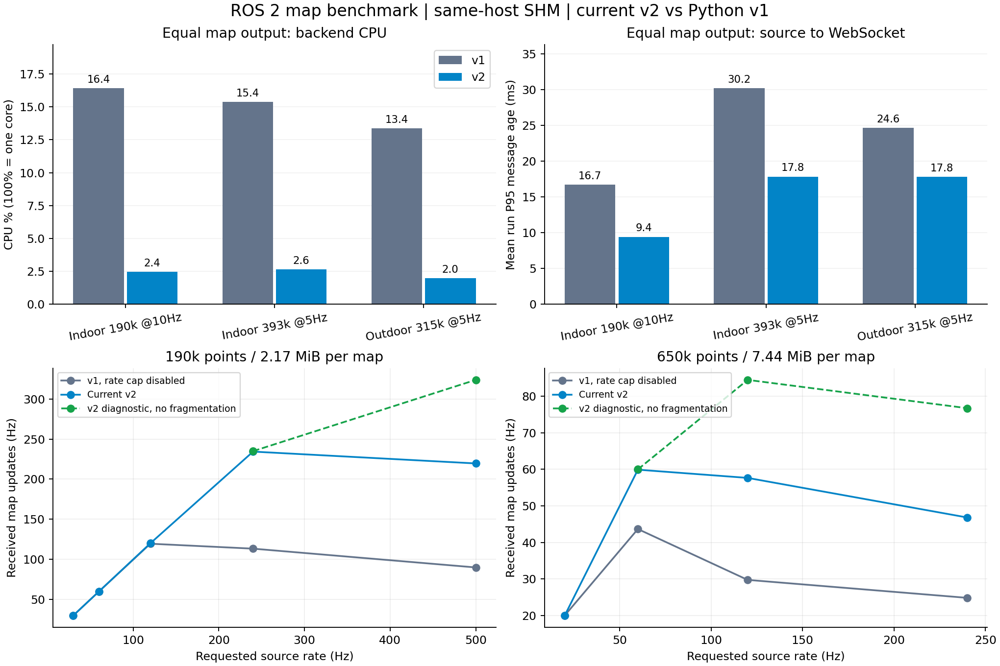
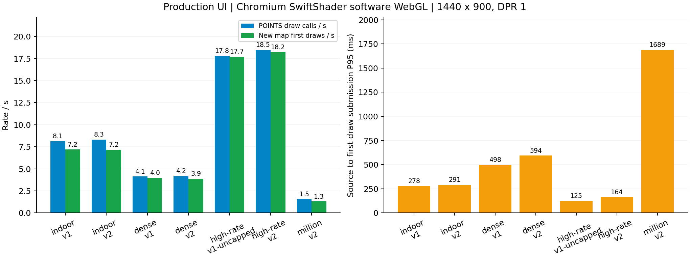

# ROS 2 点云地图：v1 / v2 性能与极限测试

日期：2026-09-15。共完成 **90 轮**测量、容量检查和诊断，包含预期拒绝及浏览器退化场景，不能解读为 90 轮全部通过。

## 结论

1. **相同地图、相同实收频率下，v2 后端明显节省 CPU。** 19 万点、10 Hz：v1 16.45%，v2 2.44%；消息到达 WebSocket 的 P95 年龄为 16.68 / 9.40 ms。
2. **默认 DDS 环境先成为瓶颈。** 改成测试专用 SHM-only 配置后，两版才稳定达到地图目标频率。因此不能仅靠更换后端解决默认环境的大消息丢帧。
3. **当前 v2 的最高单客户端实测吞吐约 510 MiB/s；这不是纯服务的绝对上限。** 高档时 Python 接收器接近单核满载。临时关闭 WebSocket 自动分片后，最高测得约 704 MiB/s。
4. **60 秒较稳定档位**：19 万点，v1 解除限频后以 120 Hz 输入，实收 116.92 Hz；当前 v2 以 200 Hz 输入，实收 196.33 Hz。均无测量期间协议错误或持续明显内存增长；不是小时级稳定性证明。
5. **前端不随 C++ 改造自动变流畅。** 本机 SwiftShader 软件 WebGL：19 万点约 8 FPS，39 万点约 4 FPS，百万点约 1.5 FPS。实际平板 GPU 和局域网尚未测量。

## 数据、版本与方法

### 真实地图

| 地图 | 本机来源 | 点数 | XYZ 数据大小 |
| --- | --- | ---: | ---: |
| 室内优化子地图 | `local_data/IndoorOffice1_map_01/map.ply` | 189,966 | 2.17 MiB |
| 室内累计地图 | `local_data/IndoorOffice1_accumulating_01/map.ply` | 393,362 | 4.50 MiB |
| 室外累计地图 | `local_data/OutdoorRoad_cut0_accumulating_01/map.ply` | 315,397 | 3.61 MiB |

直接读取已有地图；C++ 发布器重复发布完整地图快照，每次写入当前时间戳。原始地图不修改。三坐标均为 float32、point_step=12、frame_id=`map`，两版完整坐标字节一致。每个协议客户端校验首帧 SHA-256、点数、步长和载荷长度。

小点数测试均匀抽取原图；65 万、100 万和约 140 万点通过循环复制真实地图点扩大数据量，属于压力数据，不代表新测绘出的更大地图。

### 环境与口径

- VMware 虚拟机，8 vCPU，CPU 标识 Intel Core i5-13500TE，约 7.7 GiB RAM；Ubuntu 22.04、Linux 6.8.0-138-generic、ROS 2 Humble、Fast DDS。
- v1：当前工作区的 Python ROS 2 后端，点云数据路径对应 `1.5.0`；v2：第一阶段当前 C++ 实现。前端使用同一个 1.5.0 生产构建，通过 `?backend=v1/v2` 切换。
- Git 基线 `0e36823`；v2 第一阶段代码尚未提交。源码、前端产物和两个原生二进制的 SHA-256 见 [provenance.json](benchmarks/ros2-map-2026-09-15/provenance.json)。
- 测试独立 Domain 191、后端 `127.0.0.1:18191`；C++ 发布器、独立 C++ DDS 探针、后端、接收器分别计数和采集 CPU。只发布 `/benchmark/map`，没有运动控制。
- QoS：BEST_EFFORT、VOLATILE、KEEP_LAST(1)。两版都发送完整 XYZ；关闭 WebSocket 压缩。v1 显式使用 Uvicorn `--ws websockets`。
- 基准采用 A/B/B/A，每图每版两轮，预热 3 秒、数据窗口 15 秒。压力档每轮 12 秒，容量检查 8 秒，并发检查 30 秒，稳定档 60 秒。
- CPU **100% 表示一个核**。RSS/PSS/USS 分开保存；RSS 不能直接视为独占物理内存。吞吐为 RVPC 应用帧，不含 TCP/WebSocket 头。
- “消息年龄”为同机源时间戳到接收的时间；ping 为应用层往返。均不是跨机器时钟未同步条件下的端到端延迟。
- 接收器处于同一 Python 进程，多客户端极高聚合吞吐会先受接收器限制。独立 DDS 探针也不等于后端自身的 ROS 回调计数。
- 后端 RSS >1 GiB 或系统可用内存 <1 GiB 时停止；本次未触发。测试进程已清理，未等待系统 OOM。

## 1. 默认 DDS 条件

使用默认 Fast DDS 配置与 `ROS_LOCALHOST_ONLY=1`，不调内核 socket 参数。

| 地图 / 目标频率 | v1 实收 Hz | v2 实收 Hz | v1 CPU | v2 CPU |
| --- | ---: | ---: | ---: | ---: |
| 19 万点 / 10 Hz | 4.80 | 4.20 | 12.39% | 1.26% |
| 39 万点 / 5 Hz | 1.20 | 2.27 | 10.57% | 1.26% |
| 31 万点 / 5 Hz | 1.90 | 2.37 | 10.46% | 1.06% |

源端达到目标频率，独立 DDS 探针也出现明显丢帧与轮次波动。不能由此表认定 v2 改善或恶化了 DDS 接收能力；低 CPU 同时伴随低接收量。

本机观察到默认共享内存段约 0.5 MiB、socket rmem_max 为 212,992 B。随后只对测试子进程使用 64 MiB SHM 段、20,000,000 B 最大传输消息、禁用内置 UDP 的配置。两版和发布器/探针使用同一配置，接收恢复正常。这个对照支持先处理 DDS 大消息传输条件，**没有单独证明是共享内存段还是 UDP 路径中的哪一项造成全部丢帧**。配置参考 [Fast DDS 2.6 共享内存说明](https://fast-dds.docs.eprosima.com/en/2.6.x/fastdds/transport/shared_memory/shared_memory.html)。

该 SHM-only 配置仅适用于同机，不能直接当作机器人到远端电脑的网络部署方案。

## 2. 等量输出的公平比较

以下均使用上述 SHM-only 对照。CPU、RSS 为两轮均值；P95 是各轮分位数的均值，不是合并样本的分位数，也没有统计置信区间。

| 地图 / 两版实收 | 版本 | CPU | RSS MiB | 点云年龄 P95 ms | ping P95 ms |
| --- | --- | ---: | ---: | ---: | ---: |
| 189,966 点 / 10 Hz | v1 | 16.45% | 352.45 | 16.68 | 3.95 |
| 同上 | v2 | 2.44% | 285.50 | 9.40 | 3.75 |
| 393,362 点 / 5 Hz | v1 | 15.40% | 367.19 | 30.23 | 4.31 |
| 同上 | v2 | 2.63% | 294.77 | 17.83 | 8.69 |
| 315,397 点 / 5 Hz | v1 | 13.37% | 361.25 | 24.65 | 3.64 |
| 同上 | v2 | 1.98% | 291.17 | 17.78 | 4.68 |

相同输出下，v2 CPU 降低约 83–85%，点云到达年龄也更低；**ping 并非每个场景都更低**。SHM 配置本身增加了明显的常驻缓冲开销，不能把这里的 RSS 与默认 DDS 表的内存跨条件比较。

## 3. 提高频率与过载

v1 默认每话题最多转发 10 Hz。5 万点 / 60 Hz 输入实测仅输出 **10.00 Hz**，这是配置限制。

为比较处理能力，以下 `v1*` 仅在独立测试进程把 `ros_pointcloud_max_hz` 设为 0，保留 8 MiB 大小限制；没有改产品默认值。每档只有一次 12 秒探索性测量。

| 点数 | 目标 Hz | 实际源 Hz：v1* / v2 | 输出 Hz：v1* / 当前 v2 | 后端 CPU：v1* / v2 |
| ---: | ---: | ---: | ---: | ---: |
| 50,000 | 120 | 119.83 / 119.58 | 119.33 / 119.42 | 31.58% / 7.92% |
| 50,000 | 500 | 483.33 / 487.42 | 325.17 / 465.08 | 70.54% / 26.83% |
| 189,966 | 120 | 119.92 / 120.00 | 119.50 / 120.00 | 74.24% / 27.00% |
| 189,966 | 240 | 234.75 / 238.83 | 113.33 / 234.33 | 127.07% / 55.75% |
| 189,966 | 500 | 464.08 / 478.50 | 89.92 / 219.58 | 132.24% / 96.75% |
| 650,000 | 20 | 20.00 / 20.00 | 20.00 / 20.00 | 52.33% / 15.58% |
| 650,000 | 60 | 60.00 / 59.92 | 43.67 / 59.92 | 141.53% / 48.66% |
| 650,000 | 120 | 119.17 / 119.75 | 29.75 / 57.67 | 155.32% / 94.50% |
| 650,000 | 240 | 173.75 / 160.50 | 24.83 / 46.83 | 172.02% / 143.58% |

- 继续增大发布频率会进入过载区，输出反而下降；不能把发布器“设置为 500 Hz”写成系统支持 500 Hz。
- 当前 v2 最高实测单客户端吞吐：**509.54 MiB/s**，19 万点、目标 240 Hz，实收 234.33 Hz。此时接收器 CPU **96.33%**。
- v1* 最高实测吞吐：**324.84 MiB/s**，65 万点、目标 60 Hz，实收 43.67 Hz；其后端 CPU 141.53%，已经丢帧。
- v2 19 万点 / 500 Hz 档接收器 CPU 103.91%，65 万点 / 120 Hz 档 104.50%（含采样线程）。本轮到达了测试接收链路的限制，不能据此声称找到 C++ 服务的绝对吞吐上限。

### 60 秒较稳定档复验

| 版本 / 目标 | 实际源 Hz | 实收 Hz | 吞吐 MiB/s | CPU | 点云年龄 P95 ms | ping P95 ms | RSS 首/尾 3秒均值 MiB |
| --- | ---: | ---: | ---: | ---: | ---: | ---: | ---: |
| v1* / 19万点 120 Hz | 119.90 | 116.92 | 254.2 | 85.15% | 24.01 | 8.66 | 367.08 → 369.07 |
| 当前 v2 / 19万点 200 Hz | 199.28 | 196.33 | 426.9 | 49.05% | 14.09 | 13.31 | 291.93 → 294.11 |

两轮都应答 120 次 ping，测量期间无协议错误；这是两个已验证档位，不是精确二分搜索出的频率边界，也不是长期无泄漏证明。

## 4. 单帧点数边界

固定 1 Hz，检查独立 DDS 探针能收到，再检查后端是否转发。以下仅适用于 XYZ 三个 float32，即每点 12 B。

| 版本 | 点数 / 原始数据量 | 结果 |
| --- | --- | --- |
| v1 | 699,050 / 8,388,600 B | 完整接收，哈希正确 |
| v1 | 700,000 / 8,400,000 B | 拒绝，返回超过 8,388,608 B 的消息错误 |
| v2 | 1,000,000 / 12,000,000 B | 完整接收，哈希正确 |
| v2 | 1,398,000 / 16,776,000 B | 完整接收，哈希正确 |
| v2 | 1,400,000 / 16,800,000 B | 跳过，服务端记录超过上限；ping 继续正常 |

v1 限制输入数据为 8 MiB；v2 限制完整应用帧为 16 MiB，含元数据，因此实际边界略低于 16 MiB / 12。增加 intensity、ring 等字段会降低相同字节限制下的点数。**v2 当前超大帧只写日志，前端缺少明确容量错误提示。**

## 5. 并发和停读客户端

19 万点地图、10 Hz。正常客户端持续读取并 ping，停读客户端确认订阅后停止读取，接收队列设为 1。

| 版本 | 正常 / 停读 | 每个正常客户端 Hz | 总吞吐 MiB/s | CPU | RSS 峰值 MiB | 最差客户端 ping P95 ms |
| --- | --- | ---: | ---: | ---: | ---: | ---: |
| v1 | 4 / 0 | 10.00 | 86.98 | 17.13% | 382.80 | 5.50 |
| v2 | 4 / 0 | 10.00 | 86.98 | 8.60% | 292.13 | 34.87 |
| v1 | 8 / 2 | 10.00 | 173.96 | 25.83% | 446.52 | 13.48 |
| v2 | 8 / 2 | 10.00 | 173.96 | 17.50% | 298.23 | 25.11 |

- 未重现无界快速内存积压。v1 的 RSS 首/尾 3 秒均值 423.45 → 443.32 MiB，v2 为 288.20 → 289.26 MiB；30 秒不足以排除长期问题。
- v1 两个停读连接触发 2 秒发送超时，但窗口结束后的状态查询仍报告 11 个连接（8 正常 + 2 停读 + 查询连接）；直到测试客户端主动断开才完成记录清理。
- v2 已释放两个停读连接：8 正常连接保留时，再建立 8 个空闲连接全部成功，第 17 个被拒绝，符合服务的 16 连接上限。
- v2 当前每个客户端独立创建 ROS 订阅与编码，CPU 随客户端数增长明显。多客户端场景中的优势小于单客户端，ping 也可能更高。

## 6. 自动分片诊断：尚未应用到产品

安装的 Boost.Beast 默认启用自动分片，缓冲为 4096 B。低频检查实际数到：当前 v2 一帧 19 万点地图由 **557 个 WebSocket 帧**组成。

只在临时源码副本中添加 `socket_.auto_fragment(false)`，重新构建。协议 CTest、载荷哈希、并发和慢客户端检查仍通过；实测同一消息变为 **1 个 WebSocket 帧**。

| 同一目标负载 | 当前 v2 | 临时诊断版 |
| --- | ---: | ---: |
| 19万点 / 500 Hz：实收 Hz | 219.58 | 323.75 |
| 同上：吞吐 MiB/s | 477.47 | 703.98 |
| 65万点 / 120 Hz：实收 Hz | 57.67 | 84.50 |
| 同上：吞吐 MiB/s | 428.99 | 628.61 |
| 8正常+2停读、每人10 Hz：后端 CPU | 17.50% | 11.33% |

结果支持优先调整分片策略；诊断版高档仍由接收器单核容量限制，并非没有更高上限。**704 MiB/s 是临时诊断构建的结果，不是当前 v2 的结果。** 补丁和重建脚本随报告保存，当前产品源码未应用该改动。

## 7. 真实浏览器与渲染边界

生产前端通过 Vite preview 代理连接真实 ROS 后端，1440×900、DPR=1，统一相机、点大小、sampleStep=1，无 TF 转换。配置与版本 HTTP 使用测试响应，避免写用户配置；ROS 订阅、Worker 解码与 Three.js 绘制都真实执行。

### 固定 SwiftShader 口径

下表是软件 WebGL 的测量，**不能作为真实平板或独立 GPU 的性能上限**。POINTS 绘制率代表提交绘制调用，未测量物理屏幕呈现完成时刻。有效新图率只统计一个新解码地图首次参与绘制，避免用反复画旧数据虚增结果。

| 负载 / 版本 | WS 收帧 Hz | POINTS 绘制 FPS | 有效新图 Hz | 首次绘制年龄 P95 ms |
| --- | ---: | ---: | ---: | ---: |
| 19万点 10 Hz / v1 | 10.04 | 8.11 | 7.18 | 277.9 |
| 19万点 10 Hz / v2 | 10.04 | 8.31 | 7.18 | 291.4 |
| 39万点 5 Hz / v1 | 5.04 | 4.13 | 3.96 | 497.8 |
| 39万点 5 Hz / v2 | 5.03 | 4.20 | 3.87 | 594.0 |
| 5万点 120 Hz / v1* | 119.99 | 17.79 | 17.71 | 125.0 |
| 5万点 120 Hz / v2 | 120.07 | 18.48 | 18.24 | 163.9 |
| 100万点 5 Hz / v2 | 4.88 | 1.55 | 1.30 | 1688.6 |

19 万点固定配置另复测一次，两版均持续收到 10 Hz、绘制约 8.12 FPS。19/39 万点的 Worker 往返 P95 约 5–7 ms，但首次绘制年龄达到数百毫秒；该环境主要受渲染和主线程调度限制。浏览器进程树在 19 万点时合计约占 5 个 CPU 核，软件光栅化开销远大于 v2 后端。

### 自动图形选择的失败对照

尝试自动选择 GPU 并忽略阻止列表，实际 renderer 仍是 SwiftShader，没有获得硬件加速。这组轮次出现发送超时、缓慢消耗旧帧和请求超时：19 万点名义仍绘制约 9 FPS，有效新图却不足 1 Hz，首次绘制年龄 P95 达 12–18 秒；百万点测量窗口没有收到新 WebSocket 地图。

这组**不算可用性能通过**，已单独归档为 `browser-auto-gpu`。恢复固定 SwiftShader 参数后，两版重复测试重新保持 10 Hz 收帧。自动图形路径为何造成停读尚未进一步定位，不能归因于 C++ 后端或据此声称硬件 GPU 性能差。

v2 点云单类型场景还记录到隐藏图表面板“没有支持的消息类型”提示；固定配置下不影响点云持续显示。它属于待处理 UI 状态问题，记录在原始浏览器日志中。

## 建议的开发顺序

1. 将经过独立诊断验证的 WebSocket 分片调整作为单独改动，并保留大帧、退订和慢连接回归。
2. v2 共享同一话题的 ROS 订阅及编码结果，减少多客户端重复工作。
3. 对地图加入点数预算、按视角采样或分块加载；用真实平板硬件加速浏览器重复测试。仅降低后端 CPU 无法解决软件渲染瓶颈。
4. 补齐超大帧提示、停读连接清理和前端超时恢复，避免“连接仍显示正常、画面已陈旧”。
5. 用原生或多进程接收器继续测纯服务上限，并补测实际局域网和 ROS 1。当前约 510/704 MiB/s 的数字都不代表无线网络或产品最终容量。

## 复现与原始证据

- [基准脚本与命令](../scripts/benchmarks/README.md)
- [全部归一化结果 JSON](benchmarks/ros2-map-2026-09-15/results.json)
- [汇总 CSV](benchmarks/ros2-map-2026-09-15/summary.csv)
- [原始采样、计划和日志归档](benchmarks/ros2-map-2026-09-15/raw-evidence.tar.gz)
- [真实室内地图渲染截图](benchmarks/ros2-map-2026-09-15/map-v2.png)
- [分片诊断补丁](benchmarks/ros2-map-2026-09-15/diagnostic.patch)

临时执行目录 `/tmp/rviz-map-bench`。持久归档不含地图坐标载荷，保留来源路径、哈希、逐帧时间、CPU/内存采样、退出码和错误。早期基准采样结束略晚于固定数据窗口，汇总脚本已按原始时间戳统一窗口，CPU 保留实际采样时长。

压力测试的 6 个客户端在测量结束后取消分片接收时，触发 Python websockets 16.1.1 的 `cannot reset() while queue isn't empty` 关闭期断言。原始错误保留，并单列 `teardown_errors`；没有当作服务器测量期间崩溃。后续脚本改为先关闭连接再取消读取，后续轮次未复现。
